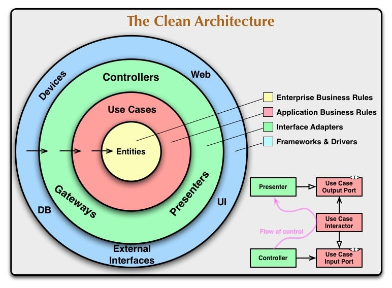

# What?

## Concept

Clean Architecture là một triết lý thiết kế kiến trúc phần mềm được đề xuất bởi [Uncle Bob](https://blog.cleancoder.com/uncle-bob/2012/08/13/the-clean-architecture.html) với mục tiêu làm code:

- Dễ đọc.
- Dễ test.
- Dễ maintain hơn.
- Dễ tuỳ biến.

Ý tưởng code cốt lõi của thiết kế này là Seperation of Concern

- Độc lập với Framework: Dùng Gin, Fiber hay framework nào thì hệ thống vẫn chạy.
- Độc lập với UI: Dùng giao diện web hay console thì hệ thống vẫn chạy.
- Độc lập với database: Dùng MongoDB, PostgreSQL,... thì hệ thống vẫn chạy.
- Độc lập với external tools: Dùng giải pháp thanh toán bất kỳ (Stripe, VNPay,...), message queue (Redis, DragonFly,...) thì nên tránh ảnh hưởng trực tiếp đến core của hệ thống.

## Structure Diagram


Để trực quan hơn, tôi sẽ tiến hành phân tích từng tầng của kiến trúc này.

### Entities

- Vị trí: Vòng màu vàng
- Chức năng: Chứa các **quy tắc nghiệp vụ mức cao nhất**.
- Đặc điểm: Không thay đổi ngay cả khi ứng dụng thay đổi.

### Use Cases

- Vị trí: Vòng màu đỏ
- Chức năng: Chứa các **quy tắc nghiệp vụ của ứng dụng**. Nó đóng gói và implement các usecase của ứng dụng. Usecases điều phối luồng dữ liệu giữa các entity để đạt được mục tiêu của usecase hay còn gọi là user requirements.
- Đặc điểm:
  - Thay đổi ở tầng này không ảnh hưởng đến entities.
  - Thay đổi ở Frameworks & Driver layer không ảnh hưởng đến tầng này.

### Interface Adapters

- Vị trí: Vòng màu xanh lá
- Chức năng: Chuyển đổi dữ liệu từ thuận tiện cho usecase/entities sang thuận tiện cho external services và ngược lại
- Đặc điểm:
  - Tầng bên trong không được biết về external services
  - Tầng sâu nhất được biết về external service
  - Tầng này tương đương với kiến trúc [MVC](https://www.tutorialspoint.com/mvc_framework/mvc_framework_introduction.htm) với các thành phần:
    - Controllers: Truyền dữ liệu vào usecases
    - Views: Nhận dữ liệu từ usecases
    - Presenters: Nhận dữ liệu từ usecases

### Frameworks & Driver

- Vị trí: Vòng màu xanh dương
- Chức năng: Implement chi tiết các chức năng với Framework, Database được chọn.
- Đặc điểm: Tầng này được để ngoài cùng để không gây hại do có thể thay đổi nhiều.

### Nguyên tắc chung

- Không nhất thiết phải chỉ có 4 vòng này, có thể có hơn.
- Mọi tầng đều tuyên theo **Dependency Rule**: Vòng bên ngoài phụ thuộc vào vòng bên trong, không có chuyện ngược lại.
- Nếu có trường hợp tầng trong muốn gọi đến tầng ngoài. Ví dụ tầng usecases muốn gọi đến tầng adapters. Ta có thể áp dụng quy tắc [**Dependency Inversion Principle**](https://en.wikipedia.org/wiki/Dependency_inversion_principle) để đảo chiều phụ thuộc mã nguồn. Ví dụ: Trong ngôn ngữ như Go, ta sử dụng interface để đảo ngược phụ thuộc mã nguồn, sao cho các tầng bên trong không cần biết các tầng ngoài, nhưng vẫn gọi được logic tầng ngoài.

# Why?

## Pros

Như trên

## Cons

- Chi phí phát triển ban đầu cao và tăng độ phức tạp: Phải thêm nhiều layer và interface
- Steep Learning Curve: Lúc đầu có thể mất nhiều thời gian để học
- Potential Performance Overhead: Với hệ thống cần phản hồi cực nhanh như High Frequency Trading System thì việc đi qua nhiều tầng có thể giảm hiệu năng dù không đáng kể.

=> Hiệu quả cho hệ thống:

- Lớn
- Lâu dài

## Compare to other

- **Monolithic**:
  - Tất cả logic nằm trong một khối duy nhất, dễ phát triển ban đầu nhưng khó mở rộng, bảo trì, và kiểm thử khi hệ thống lớn dần.
  - Phù hợp với dự án nhỏ, ít thay đổi, không yêu cầu mở rộng nhanh.
- **Layered Architecture (N-tier)**:
  - Chia thành các tầng như Presentation, Business Logic, Data Access.
  - Dễ hiểu, phổ biến nhưng các tầng vẫn có thể phụ thuộc lẫn nhau, khó kiểm soát phụ thuộc khi hệ thống phức tạp.
- **Microservices**:
  - Chia nhỏ hệ thống thành các dịch vụ độc lập, dễ mở rộng, triển khai riêng biệt.
  - Tuy nhiên, tăng độ phức tạp về vận hành, yêu cầu DevOps, CI/CD, monitoring tốt.
  - Phù hợp với hệ thống rất lớn, nhiều team phát triển song song.

## Conclude

Với yêu cầu phát triển lớn ở mức độ trung bình:

- Tối đa 5 service.
- Lượng người dùng vừa (< 10000).
- Có thể thay đổi framework, DB, external service theo thời gian.
- Code dễ test, maintain.

Tôi quyết định áp dụng Clean Architecture cho dự án này vì nó đáp ứng đầy đủ các yếu tố trên.

# How?

## Ví dụ luồng tạo tin tức mới theo Clean Architecture

Để cho người đọc có cái nhìn dễ hiểu hơn, tôi sẽ ví dụ một luồng implement Clean Architecture trong dự án này. Ví dụ ở đây là tôi sẽ thực hiện với chức năng tạo tin tức mới.

### 1. Entities (internal/domain/entities/user.go)

Theo Uncle Bob, entities ở hệ thống mức độ doanh nghiệp sẽ khác một app nhỏ lẻ. Cụ thể entities ở các app nhỏ sẽ định nghĩa dưới dạng các business object. Vì đây là một ứng dụng quy mô nhỏ, nên entities sẽ được định nghĩa dưới dạng các business object đơn giản.

```go
type News struct {
	ID          int64     `json:"id"`
	Title       string    `json:"title"`
	Description string    `json:"description"`
	Content     string    `json:"content"`
	Image       string    `json:"image"`
	AuthorID    int64     `json:"author_id"`
	Author      string    `json:"author"`
	CreatedAt   time.Time `json:"created_at"`
	UpdatedAt   time.Time `json:"updated_at"`
}
```

### 2. Use Case (internal/domain/usecases/news/create.go)

Chứa logic nghiệp vụ tạo tin tức mới, kiểm tra tiêu đề trùng, gọi repository để lưu tin tức:

```go
type ICreateNewsUseCase interface {
	Execute(ctx context.Context, req dto.CreateNewsToDBRequest) (*dto.CreateNewsResponse, error)
}

type CreateNewsUseCase struct {
	newsRepository adapters.INewsRepository
}

func NewCreateNewsUseCase(newsRepository adapters.INewsRepository) ICreateNewsUseCase {
	return &CreateNewsUseCase{
		newsRepository: newsRepository,
	}
}

func (u *CreateNewsUseCase) Execute(ctx context.Context, req dto.CreateNewsToDBRequest) (*dto.CreateNewsResponse, error) {
	// Validate input
	if req.Title == "" || req.Description == "" || req.Content == "" {
		return nil, ErrInvalidNewsData
	}

	// Tạo entity News
	news := &entities.News{
		Title:       req.Title,
		Description: req.Description,
		Content:     req.Content,
		AuthorID:    req.AuthorID,
		Image:       req.Image,
		CreatedAt:   time.Now(),
		UpdatedAt:   time.Now(),
	}

	// Lưu vào database
	createdNews, err := u.newsRepository.CreateNews(ctx, news)
	if err != nil {
		return nil, err
	}

	// Map entity sang DTO
	return &dto.CreateNewsResponse{
		ID:          createdNews.ID,
		Title:       createdNews.Title,
		Description: createdNews.Description,
		Content:     createdNews.Content,
		AuthorID:    createdNews.AuthorID,
		Image:       createdNews.Image,
		CreatedAt:   createdNews.CreatedAt.Format(time.RFC3339),
	}, nil
}

```

Chi tiết tại [`internal/domain/usecases/news/create.go`](/internal/domain/usecases/news/create.go).

Chú ý phần khởi tạo interface ICreateNewsUseCase và struct CreateNewsUseCase thay vì dùng thẳng struct. Lý do là vì:
1. CreateNewsUseCase sẽ bị phụ thuộc vào createNews handler nếu chỉ dùng struct.
2. Áp dụng quy tắc Dependency Inversion bằng cách tạo một interface trung gian. Use Case và handler nhờ đó sẽ trị phụ thuộc vào abstraction mà không phụ thuộc vào implementation cụ thể. Từ đó dễ thay đổi cách implementation.
3. Dễ viết unit test cho handler bằng cách mock interface ICreateNewsUseCase

### 3. Interface Adapters (internal/domain/adapters/news_repository.go, internal/infra/api/handlers/news_handler.go)

- **Repository Adapter**:
  Interface này định nghĩa các thao tác dữ liệu (CRUD) mà tầng usecase sẽ sử dụng. Nó nằm trong `file internal/domain/adapters/news_repository.go`. Implementation cụ thể (kết nối database, truy vấn SQL,...) sẽ được thực hiện ở tầng Frameworks & Drivers. Việc usecase chỉ phụ thuộc vào interface giúp tách biệt logic nghiệp vụ khỏi công nghệ lưu trữ cụ thể (PostgreSQL, MongoDB,...).

- **Handler (API Adapter)**:
  Nhận HTTP request từ client, validate input, chuyển đổi dữ liệu sang dạng phù hợp cho usecase, gọi usecase thực thi logic nghiệp vụ, nhận kết quả và trả response về client.
  Handler chỉ phụ thuộc vào abstraction (interface usecase), không phụ thuộc vào implementation cụ thể.
  Ví dụ handler nằm ở `internal/infra/api/handlers/news_handler.go`.
Ví dụ repository:
```go
type INewsRepository interface {
	ListNews(ctx context.Context, page int, limit int) ([]entities.News, error)
	DeleteNewsByID(ctx context.Context, newsID int64) error
	CreateNews(ctx context.Context, news *entities.News) (*entities.News, error)
	UpdateNews(ctx context.Context, news *entities.News) (*entities.News, error)
	GetNews(ctx context.Context, id int64) (entities.News, error)
}

```
Ví dụ handler:
```go
func (h *NewsHandler) CreateNews(c *gin.Context) {
    var req CreateNewsRequest
    if err := c.ShouldBindJSON(&req); err != nil {
        c.JSON(http.StatusBadRequest, gin.H{"error": err.Error()})
        return
    }
    news, err := h.createNewsUseCase.Execute(c.Request.Context(), req.ToParams())
    if err != nil {
        c.JSON(http.StatusBadRequest, gin.H{"error": err.Error()})
        return
    }
    c.JSON(http.StatusOK, news)
}
```

### 4. Frameworks & Drivers
Tầng Frameworks & Drivers là nơi hiện thực chi tiết các chức năng kỹ thuật như kết nối cơ sở dữ liệu, định tuyến HTTP, chạy web server,... Đây là tầng ngoài cùng, nơi dễ thay đổi nhất nếu ta thay đổi framework, cơ sở dữ liệu hoặc công nghệ tích hợp.

- **Repository Implementation:**
File `internal/infra/postgresql/news_repository.go` hiện thực interface `INewsRepository` bằng cách thao tác trực tiếp với PostgreSQL thông qua các hàm truy vấn SQL.
Ví dụ:
```go
  type NewsModelRepositoryPostgres struct {
      store db.Store
  }

  func NewNewsModelRepositoryPostgres(store *db.Store) adapters.INewsRepository {
      return &NewsModelRepositoryPostgres{store: *store}
  }
  func (r *NewsModelRepositoryPostgres) CreateNews(ctx context.Context, news *entities.News) (*entities.News, error) {
    newsModel := db.CreateNewsParams{
      Title:       news.Title,
      Description: pgtype.Text{String: news.Description, Valid: news.Description != ""},
      Content:     pgtype.Text{String: news.Content, Valid: news.Content != ""},
      Image:       pgtype.Text{String: news.Image, Valid: news.Image != ""},
      AuthorID:    pgtype.Int8{Int64: news.AuthorID, Valid: news.AuthorID != 0},
    }

    createdNews, err := r.store.CreateNews(ctx, newsModel)
    if err != nil {
      return nil, fmt.Errorf("failed to create news post: %w", err)
    }

    return &entities.News{
      ID:          createdNews.ID,
      Title:       createdNews.Title,
      Description: createdNews.Description.String,
      Content:     createdNews.Content.String,
      Image:       createdNews.Image.String,
      AuthorID:    createdNews.AuthorID.Int64,
      CreatedAt:   createdNews.CreatedAt,
      UpdatedAt:   createdNews.UpdatedAt,
    }, nil
  }
```

- **Routing:**
  File `internal/infra/api/routes/news_routes.go` định nghĩa các endpoint HTTP và ánh xạ chúng tới các handler:
  ```go
  func RegisterNewsRoutes(router *gin.RouterGroup, newsHandler *handlers.NewsHandler) {
      new := router.Group("/news")
      {
          new.GET("/", newsHandler.ListNews)
          new.GET("/:id", newsHandler.GetNews)
          new.DELETE("/", newsHandler.DeleteNews)
          new.POST("/", newsHandler.CreateNews)
      }
  }
  ```

- **Khởi tạo ứng dụng:**
  Trong file `cmd/api/main.go` (hoặc tương tự), bạn sẽ:
  - Khởi tạo kết nối database.
  - Khởi tạo repository, usecase, handler.
  - Đăng ký các route.
  - Start HTTP server.
  Ví dụ:
  ```go
  func main() {
      // Khởi tạo DB, repository, usecase, handler
      r := gin.Default()
      newsHandler := NewNewsHandler(...)
      r.POST("/news", newsHandler.CreateNews)
      r.Run()
  }
  ```

### Tổng kết luồng
1. **Client** gửi request tạo tin tức mới tới API.
2. **Handler** nhận request, validate, chuyển dữ liệu sang usecase.
3. **Usecase** kiểm tra nghiệp vụ, gọi repository để lưu tin tức.
4. **Repository** thao tác với database.
5. **Kết quả** trả về client.

Luồng này đảm bảo separation of concerns, mỗi tầng chỉ quan tâm đúng trách nhiệm của mình, dễ mở rộng, test và bảo trì.