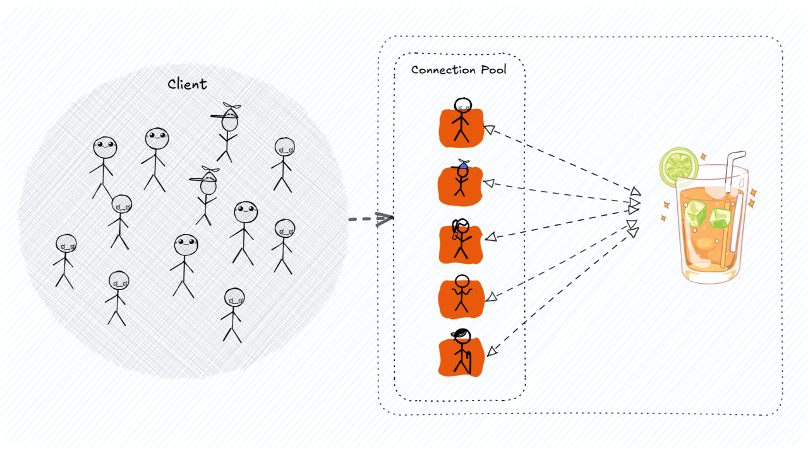
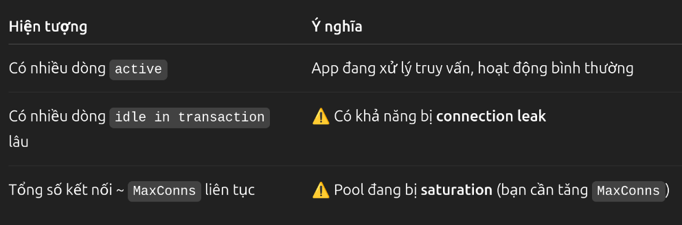

# Connection Pool

## Mục tiêu
Thiết lập connection pool để đảm bảo tận dụng tài nguyên hệ thống hiệu quả

## Trường hợp không sử dụng connection pool
Mỗi khi client có yêu cầu kết nối, server sẽ làm những điều sau:
- Thiết lập kết nối.
- Giải phóng kết nối.

=> Điều này có thể dẫn đến những điều sau:
- **Chờ đợi lâu:** Client sẽ chờ đợi thiết lập cơ sở dữ liệu.
- **Lãng phí tài nguyên:** Server sẽ mất công sức thiết lập/giải phóng kết nối thay vì tập trung xử lý các thao tác nghiệp vụ.
- **Hiệu suất kém:** Server có thể bị quá tải trong thời điểm tải cao.

## Lý do sử dụng
### Ưu điểm
- **Giảm độ trễ:** Loại bỏ thời gian chết để thiết lập kết nối mới cho mỗi yêu cầu. Ứng dụng có thể truy cập database gần như tức thời.✅
- **Tăng hiệu suất:** Tái sử dụng kết nối giúp giảm tải cho database server, tăng khả năng xử lý đồng thời và duy trì hiệu suất cao, đặc biệt trong các ứng dụng có lượng truy cập lớn.✅
- **Tiết kiệm tài nguyên:** Giảm thiểu chi phí khởi tạo và giải phóng kết nối, giúp tối ưu hóa việc sử dụng tài nguyên hệ thống.✅
- **Quản lý kết nối hiệu quả:** Connection Pool cung cấp cơ chế quản lý tập trung các kết nối, giúp dễ dàng theo dõi, giám sát và cấu hình số lượng kết nối, thời gian timeout, ...✅
### Nhược điểm
Có thể cần quan tâm đến các vấn đề
- Số lượng kết nối là bao nhiêu để không chiếm dụng tài nguyên hệ thống hoặc client không phải đợi lâu?
- Quản lý cấu hình thế nào?
- Có bị dùng ké kết nối mà không truy cập tài nguyên không? (Connection Leak)

## Cách triển khai
Muốn triển khai connection pool chỉ cần 3 bước:
1. Phân tích chuỗi kết nối DB để khởi tạo config
2. Thiết lập cấu hình cho pool
3. Khởi tạo pool với cấu hình đã định nghĩa
4. Khi kết thúc, Close() pool để thu hồi toàn bộ kết nối.

## Code mẫu
```go
poolConfig, err := pgxpool.ParseConfig(config.DBSource)
	if err != nil {
		log.Fatal("cannot parse pool config:", err)
	}

	/*
  Logger setup
  */

	poolConfig.MaxConns = 20
	poolConfig.MinConns = 5
	poolConfig.MaxConnLifetime = 30 * time.Minute
	poolConfig.HealthCheckPeriod = 1 * time.Minute

	connPool, err := pgxpool.NewWithConfig(ctx, poolConfig)
	if err != nil {
		log.Fatal("cannot connect to database: ", err)
	}

	defer connPool.Close()
```
Để giải quyết các vấn đề đã nêu ra ở phần nhược điểm, tôi áp dụng các biện pháp sau:
1. Số lượng kết nối bao nhiêu là hợp lý?
- 👉 Cách tính gần đúng:
```
MaxConns = (CPU_Core * 2) + (Worker_Buffer)
```
Trong đó:
- CPU_Core là số core của CPU
- Worker_Buffer là số lượng kết nối dự phòng cho các goroutine có thể bị block. Tuỳ theo hệ thống có thể lấy gía trị như sau:
	- Ứng dụng nhỏ dev/test: 2-5
	- Web app trung bình: 5-15
	- Nhiều goroutine/blocking I/O: 10-30

Do hiện tại đây là ứng dụng Web app trung bình và số CPU_Core của máy host đang là 4 nên số kết nối sẽ thiết lập là: `MaxConns = (4 * 2) + 12 = 20`

- 👉 Cách thực nghiệm:
	- Đo thời gian phản hồi khi `MaxConns = 10, 20, 30....`.
	- Kiểm tra `pg_stat_activity` để xem kết nối nào đang mở.
	- Dùng `connPool.Stat()` để xem số lượng kết nối được dùng thực tế

	VD:
	- Theo dõi `pg_stat_activity` để điều chỉnh:
	
	- Theo dõi log ở ứng dụng thông qua `connPool.Stat()` để đưa ra điều chỉnh
	```go
	stat := connPool.Stat()
	fmt.Printf("Total: %d | Acquired: %d | Idle:%d | InUse: %d\n", stat.TotalConns(), stat.AcquiredConns(), stat.IdleConns(), stat.ConnsInUse())
	```
2. Quản lý cấu hình thế nào?
- Dùng biến môi trường là xong

3. Có bị dùng ké kết nối mà không truy cập tài nguyên không? (Connection Leak)
- Luôn `defer rows.Close()` và `defer tx.Rollback()` nếu có lỗi.
- Kiểm tra bằng `connPool.Stat()`.
