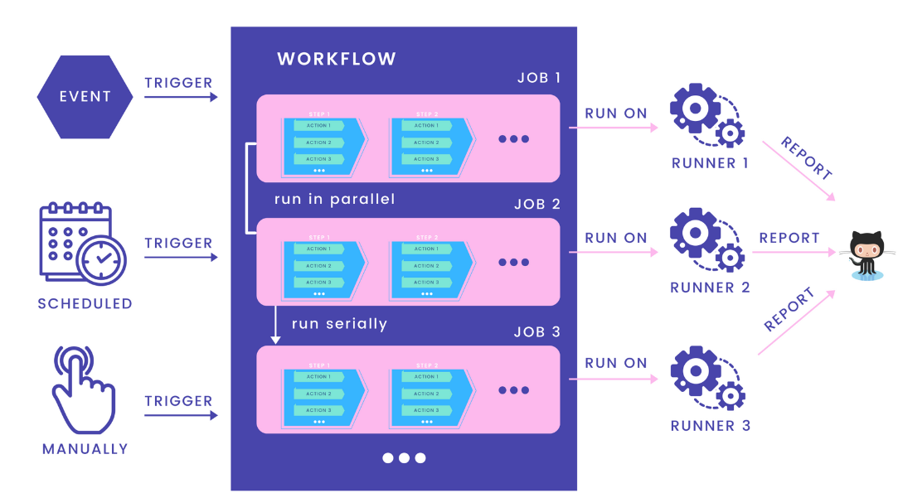

# Testing

## Mục tiêu

## Triển khai

### 1. Unit Test

Để viết unit test tôi sẽ sử dụng thư viện `testify` để tiến hành kiểm thử. Ví dụ:

```go
func TestPassword(t *testing.T) {
	password := RandomString(6)
	hashedPassword1, err := HashPassword(password)

	require.NoError(t, err)
	require.NotEmpty(t, hashedPassword1)

	err = CheckPassword(password, hashedPassword1)
	require.NoError(t, err)

	wrongPassword := RandomString(6)
	err = CheckPassword(wrongPassword, hashedPassword1)
	require.EqualError(t, err, bcrypt.ErrMismatchedHashAndPassword.Error())

	hashedPassword2, err := HashPassword(password)
	require.NoError(t, err)
	require.NotEmpty(t, hashedPassword2)
	require.NotEqual(t, hashedPassword1, hashedPassword2)

}
```

Tôi sẽ tiến hành test hàm CheckPassword và hàm HashPassword chẳng hạn.Tôi sẽ tiến hành test các trường hợp:

- Chạy không lỗi
- Mật khẩu kiểm tra khác với mật khẩu được mã hoá

### 2. Mockgen

Lý do tôi sử dụng triết lý thiết kế kiến trúc phần mềm Clean Architecture là để phục vụ do cho việc mock test. Vì lúc này chúng ta chỉ cần mock các interface với các hàm được định nghĩa, đơn giản hơn nhiều so với việc tạo một struct giả do còn phải implement các thuộc tính, phương thức, hàm khởi tạo,... Ví dụ:

```go
func TestGetNewsHandler(t *testing.T) {
	news := randomNews()

	testCases := []struct {
		name          string
		newsID        int64
		adminHeader   string
		buildStubs    func(mockUseCase *mocknews.MockIGetNewsUseCase)
		checkResponse func(t *testing.T, recorder *httptest.ResponseRecorder)
	}{
		{
			name:        "OK",
			newsID:      news.ID,
			adminHeader: "true",
			buildStubs: func(mockUseCase *mocknews.MockIGetNewsUseCase) {
				mockUseCase.EXPECT().
					Execute(gomock.Any(), news.ID).
					Times(1).
					Return(news, nil)
			},
			checkResponse: func(t *testing.T, recorder *httptest.ResponseRecorder) {
				require.Equal(t, http.StatusOK, recorder.Code)
				// Có thể kiểm tra thêm body nếu muốn
			},
		},
		{
			name:        "Unauthorized",
			newsID:      news.ID,
			adminHeader: "false",
			buildStubs: func(mockUseCase *mocknews.MockIGetNewsUseCase) {
				mockUseCase.EXPECT().Execute(gomock.Any(), gomock.Any()).Times(0)
			},
			checkResponse: func(t *testing.T, recorder *httptest.ResponseRecorder) {
				require.Equal(t, http.StatusUnauthorized, recorder.Code)
			},
		},
		{
			name:        "NotFound",
			newsID:      news.ID,
			adminHeader: "true",
			buildStubs: func(mockUseCase *mocknews.MockIGetNewsUseCase) {
				mockUseCase.EXPECT().
					Execute(gomock.Any(), news.ID).
					Times(1).
					Return(nil, sql.ErrNoRows)
			},
			checkResponse: func(t *testing.T, recorder *httptest.ResponseRecorder) {
				require.Equal(t, http.StatusNotFound, recorder.Code)
			},
		},
		{
			name:        "InvalidID",
			newsID:      0,
			adminHeader: "true",
			buildStubs: func(mockUseCase *mocknews.MockIGetNewsUseCase) {
				mockUseCase.EXPECT().Execute(gomock.Any(), gomock.Any()).Times(0)
			},
			checkResponse: func(t *testing.T, recorder *httptest.ResponseRecorder) {
				require.Equal(t, http.StatusBadRequest, recorder.Code)
			},
		},
	}

	for i := range testCases {
		tc := testCases[i]
		t.Run(tc.name, func(t *testing.T) {
			ctrl := gomock.NewController(t)
			defer ctrl.Finish()

			mockUseCase := mocknews.NewMockIGetNewsUseCase(ctrl)
			tc.buildStubs(mockUseCase)

			handler := handlers.NewNewsHandler(nil, nil, nil, nil, mockUseCase, nil)
			router := gin.Default()
			router.GET("/api/news/:id", handler.GetNews)

			url := fmt.Sprintf("/api/news/%d", tc.newsID)
			req, _ := http.NewRequest("GET", url, nil)
			req.Header.Set("admin", tc.adminHeader)
			w := httptest.NewRecorder()

			router.ServeHTTP(w, req)
			tc.checkResponse(t, w)
		})
	}
}
```

- Tiến hành mock các usecase của news bằng gomock.
- Khởi tạo dữ liệu mẫu: `news := randomNews()`
- Định nghĩa các testcase sẽ gồm:
  - Tên
  - NewsID
  - Header admin
  - buildStubs(): Giúp kiểm soát và kiếm thử chính xác hành vi của mock trong từng trường hợp test, đảm bảo handler gọi đúng logic mong muốn
  - checkRepsponse(): Kiểm tra kết quả về có đúng như mong đợi không

### 3. Tích hợp testing vào CI

Có rất nhiều công cụ hỗ trợ các task CI/CD trên thị trường như Github Actions, Gitlab, Travis, Jenkins, CircleCI. Xét trên bối cảnh dự án đơn giản, tôi quyết định sử dụng Github Action do nó đã được tích hợp sẵn trên Github.

**Cách hoạt động của Github Action**:


- Định nghĩa:
  - Workflow: Là một quy trình tự động bao gồm 1 hoặc nhiều jobs được trigger bởi các events, lịch hẹn, thao tác bằng tay. Workflow được định nghĩa trong file `.yml`.
  - Runner: Là 1 server do Github host hoặc tự host. Mỗi runner sẽ chạy 1 job và sẽ trả logs, kết quả về cho github.
  - Job: Là tập hợp các step chạy trong 1 runner, các job có thể được chạy song song hoặc nối tiếp nhau.
  - Step: Là task được chạy nối tiếp nhau trong 1 job.
  - Action: Là câu lệnh được chạy trong step và có thể được sử dụng lại nhiều lần
- File triển khai workflow "Run unit tests":

```go
name: Run unit tests

on:
  push:
    branches: [main]
  pull_request:
    branches: [main]

jobs:
  test:
    name: Test
    runs-on: ubuntu-latest

    services:
      postgres:
        image: postgres:14-alpine
        env:
          POSTGRES_USER: root
          POSTGRES_PASSWORD: secret
          POSTGRES_DB: qairline
        ports:
          - 5432:5432
        options: >-
          --health-cmd pg_isready
          --health-interval 10s
          --health-timeout 5s
          --health-retries 5

    steps:
      - name: Set up Go 1.x
        uses: actions/setup-go@v4 # ✅ update version mới nhất
        with:
          go-version: "1.21" # ✅ Go 1.24 chưa chính thức, dùng bản ổn định

      - name: Check out code
        uses: actions/checkout@v3 # ✅ version mới nhất

      - name: Install golang-migrate
        run: |
          curl -L https://github.com/golang-migrate/migrate/releases/download/v4.14.1/migrate.linux-amd64.tar.gz | tar xvz
          sudo mv migrate.linux-amd64 /usr/local/bin/migrate

      - name: Create .env from GitHub Secret
        run: |
          printf "%s" "${{ secrets.APP_ENV_CONTENT }}" > backend/.env

      - name: Run migrations
        run: make -C backend migrateup

      - name: Run unit tests
        run: make -C backend test
```

### 4. Stress test

- Môi trường:
  Do hạn chế về thiết bị nên ứng dụng hiện tại chỉ được test local, nghĩa là không qua mạng internet.

  Trong thực tế, stress test có thể gặp nhiều yếu tố: database trên production bị chậm, máy local không khoẻ bằng máy production, có thể phải đi qua lớp trung gian (reverse proxy, nginx), client trải dài toàn cầu

- Cách thức triển khai

- Quan sát:

  - Server chỉ xử lý được 500 req/s. Vì vậy, ta cần triển khai

    - Đánh giá vấn đề:

      - Đạt 100% CPU
      - Dùng hết RAM
      - Latency gọi đến Database hoặc API khác đang cao
        => Cần nhiều metric

    - Ngắn hạn:
      - Hết RAM / CPU: scale out (từ 1 -> 4 container)
      - Vấn đề ở service phía dưới: lhe để bảo ngta scale hạ tầng lên. Nếu không đồng ý thì phải:
        - Có config flag để enable hoặc disable tạm 1 số feature ngốn tài nguyên
        - Giảm batch size: Thay vì truyền 100 giá trị khi gọi API. Giảm xuống 10 thôi chẳng hạn
    - Dài hạn:
      - Lắp đặt thêm cache
      - Tạo ra bản cập nhật mới cho hệ thống:
        - Message queue
        - Async processing
        - Circuit breaker
        - Retry pattern
