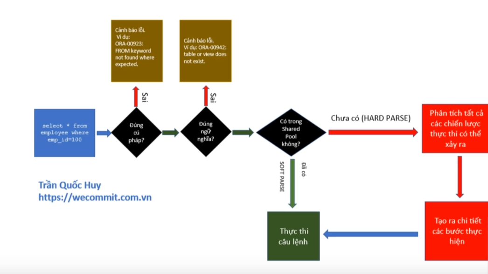

# Database

## Mục tiêu
- Thiết kế schema database để đảm bảo tính toàn vẹn dữ liệu cùng như là hiệu năng.
- Tối ưu truy vấn SQL để đảm bảo hiệu năng.
- Chuẩn hoá dữ liệu, tự động cập nhật dữ liệu thông qua Trigger & Function, indexing, constraint.

## Lựa chọn loại database
Database của hệ thống sẽ được lựa chọn dựa trên 4 tiêu chí sau:
**1. Bản chất dữ liệu được lưu trữ:**
- Với trường hợp lưu các thông tin có **cấu trúc** rõ ràng như là thông tin khách hàng, dữ liệu này rất phù hợp với các loại cơ sở dữ liệu quan hệ.
- Với trường hợp lưu các thông tin có **cấu trúc đa dạng**. Ví dụ:
  - Cần lưu thông tin của iphone15 có tới gần 20 tiêu chí khác nhau nhưng điện thoại khác lại chỉ có 10 tiêu chí
    
    
  - Nhưng ngoài ra còn có nhiều loại sản phẩm khác như áo, giày, dép chỉ có vài tiêu chí thôi
    
  - Nếu chúng ta vẫn muốn lưu vào cơ sở dữ liệu quan hệ thì hệ thống thì mỗi bản ghi sẽ phải lưu 1 số lượng cột, chưa kể là rất nhiều cột thì sẽ khó quản lý, lãng phí tài nguyên. Để khắc phục thì ta có thể sử dụng cột attribute để lưu dữ liệu json nhằm lưu các thuộc tính của sản phẩm nhưng sẽ không đúng bản chất của RDBMS lắm.
  - Sử dụng cơ sở dữ liệu lưu theo dạng document, nổi bật là MongoDB là phù hợp nhất.
- Ta hoàn toàn có thể sử dụng cả 2 loại CSDL này trong hệ thống. Tuy nhiên, xét trong bối cảnh hệ thống quản lý chuyến bay hiện tại còn khá đơn giản và dữ liệu chủ yếu là thông tin vé, chuyến bay, tàu bay, khách hàng, tin tức đều có cấu trúc khá rõ ràng. Tôi sẽ thiên về RDBMS hơn.

**2. Tài chính:**
- **Phí Lisence:** Có những loại database sẽ mất phí. Ví dụ: Oracle
- **Phí mở rộng:** Trong quá trình mở rộng ra có thể có tốn các chi phí đảm bảo tính sẵn sàng cao.
- **Phí đào tạo (know-how):**Phí đào tạo nhân viên hoặc thuê chuyên gia.

Do tôi đã có kinh nghiệm làm việc với PostgreSQL trước đó. Ngoài ra, đây là loại cở sở dữ liệu open-source nên rất phù hợp với bài toán hiện tại.

**3. Điểm hạn chế của từng DB:**
Database nào cũng sẽ nói tốt về mình trong khi db nào cũng có hạn chế, vậy nên để đảm bảo quyết định khách quan ta cần làm 2 điều sau:
- Đọc docs chính thức.
- Xem các bug, vướng mắc thực tế được nêu ở trên các diễn đàn.

**4. Cộng đồng vững mạnh:**
Chắc chắn trong quá trình sẽ gặp bug, vấn đề về tối ưu, tính sẵn sàng. Đôi khi các cái lỗi bắn ra lại khá chung chung mà không có kinh nghiệm thì rất khó. Nếu gặp lỗi mà không biết gặp ai mà có mỗi hãng để hỏi thì sẽ khá khó giải quyết hoặc trao đổi.

=> Dựa trên các yếu tố trên, tôi thấy **PostgreSQL** đảm bảo tốt cả 4 tiêu chí độ phù hợp, tài chính, điểm hạn chế chấp nhận được, cộng đồng mạnh.

## Cách triển khai
### 1. Thiết kế schema
(Làm sau)
### 2. Tạo bảng và constraint
(Làm sau)

### 3. Tối ưu truy vấn
#### Chiến lược tối ưu
Để truy vấn được tối ưu, ta cần hiểu các điều sau:


Từ đó, ta có thể áp dụng các chiến lược sau để tối ưu câu lệnh:
- Tận dụng được Soft Parse.
- Áp dụng các cách truy vấn tốt:
  1. Chỉ SELECT các cột cần thiết: chọn nhiều hơn thì mất thời gian hơn là chuyện đương nhiên.
  2. Tránh sử dụng DISTINCT: vì sẽ phải sort hoặc hash lại toàn bộ kết quả.
  3. Sử dụng JOIN thay vì Subquery.
  4. Sử dụng WHERE thay vì HAVING: vì WHERE giúp lọc trước dữ liệu + tận dụng index tốt. Trong khi đó, HAVING chỉ là lọc sau + không tận dụng được index do dữ liệu không còn dạng gốc.
  5. Sử dụng EXISTS thay vì IN hoặc NOT IN: vì EXISTS khi tìm thấy bản ghi sẽ ngay lập tức kết quả luôn chứ không như IN sẽ phải lưu tập con ra bộ nhớ rồi mới so sánh.
  6. Sử dụng UNION thay vì OR: vì OR sẽ không tận dụng được index do nếu chỉ index một nhánh thì vẫn phải ful-table scan do không chắc có thoả mãn nhánh còn lại không.
  7. Sử dụng wildcard thông minh: ví dụ `LIKE 'A%'` có thể dùng được index còn `LIKE '%A'` thì không được.
  8. Tránh gán so sánh cột với SQL Fucntion: vì điều này làm cột không dùng được index.
  9. Sử dụng LIMIT.
  10. Sử dụng index.
#### Ví dụ
Tôi từng tối ưu một truy vấn liệt kê danh sách chuyến bay có còn ghế trống, chỉ hiển thị chuyến bay trong tương lai. Truy vấn ban đầu rất chậm vì lọc sai chỗ và thiếu index

- Câu lệnh lúc đầu kém tối ưu ❌
```sql
SELECT f.flight_number
FROM Flights f
JOIN Seats s ON s.flight_id = f.flight_id
WHERE s.is_available = TRUE
  AND f.departure_time > NOW();
```
- Vấn đề với câu lệnh này:
  - Có thể trả về các chuyến bay trùng nhau nếu có nhiều chỗ trống.
  - Không dùng index.
  - Nên sử dụng WHERE trước để lọc bớt dữ liệu

- Giải pháp ✅
```sql
SELECT DISTINCT f.flight_number
FROM Flights f
WHERE s.is_available = TRUE AND f.departure_time > NOW()
JOIN Seats s ON s.flight_id = f.flight_id

CREAET INDEX idx_flights_number ON Flights(flight_number)
CREATE INDEX idx_seats_flights_available ON Seats(flight_id, is_available)
```

### 4. Trigger & Fucntion
- Dùng trigger để cập nhập trường `updated_at`


### 5. Migration & Version Control
(Làm sau)


## Hướng cải tiến
(Làm sau)
