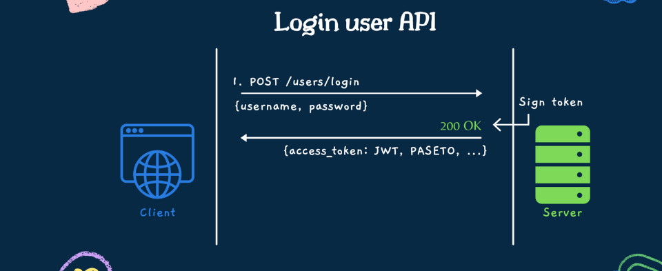
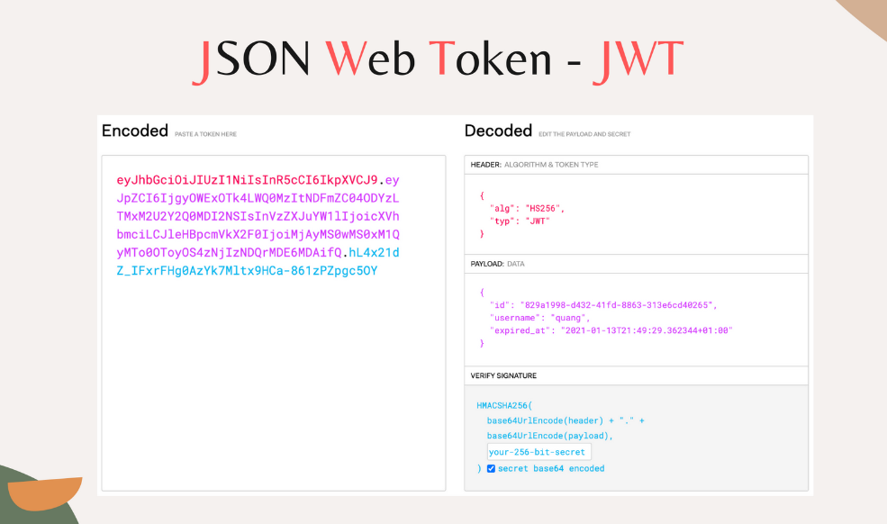
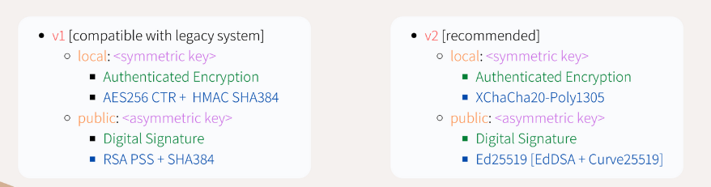
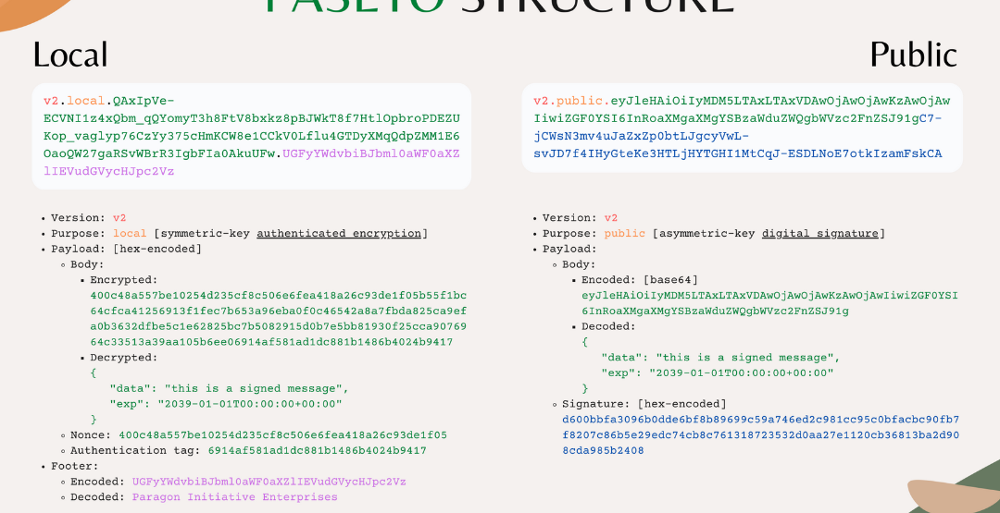
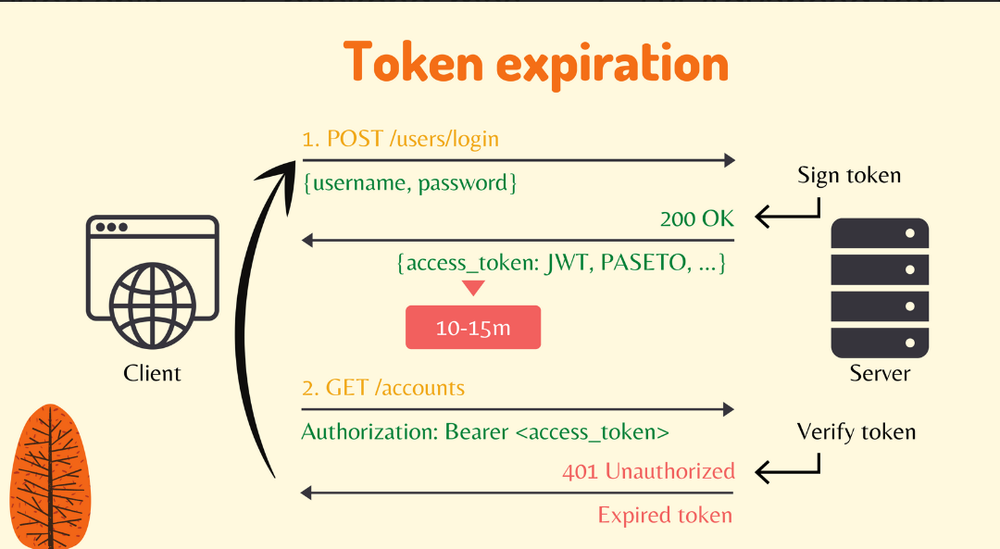
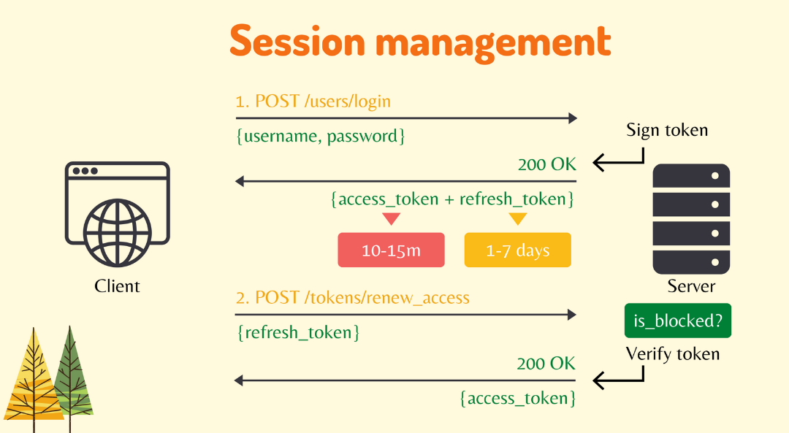
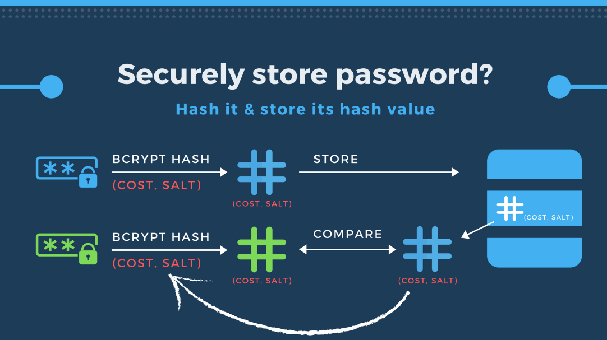

# Auth
## Mục tiêu
- Để đảm bảo tính bảo mật, ta cần làm thêm luồng xác thực cho người dùng. 2 công nghệ sẽ được sử dụng ở đây là JWT và PASETO

## Luồng gọi API


## JWT

- Phần header:
Đây là phần bao gồm thông tin thuật toán dùng để ký. Chỉ là base64 encoded nên hoàn toàn dễ để giải mã.
  + "alg": Thuật toán được sử dụng.
  + "typ": Loại token.

Lưu ý: Chỉ có phần "alg" là bắt buộc

- Phần payload:
Chứa thông tin ta muốn lưu trong token.

- Phần verify signature:
  + Đây là phần giúp server xác thực tính chính xác của token. Chỉ có server có secret key để ký phần này nên hacker tạo fake token với key thì sẽ bị phát hiện ngay.
  + Thành phần:
  ```makefile
  signature = HMACSHA256(base64UrlEncode(header) + "." + base64UrlEncode(payload),secret_key)
  ```
### Ưu điểm
- Phổ biến
- Dùng được

### Nhược điểm
- Có vài thuật toán yếu, dễ bị hack.
- Các phiên bản cũ có thể mắc các lỗi bảo mật sau:
  - Chấp nhận trường hợp `"alg" = None`. Hacker có thể dễ dàng tận dụng điều đó để giả mạo token gửi cho server. Server thấy `"alg"=None` thì sẽ bỏ qua. Các thư viện hiện đại đã ngăn chặn điều đó bằng cách trả về kết quả không hợp lệ.
  - Hacker chuyển `alg` trong header từ Asymmetric sang Symmetric. VD:
    - Server được thiết kế để dùng `RS256` -> public key công khai.
    - Server dùng trường "alg" + public key để verify.
    - Hacker tạo payload tương tự nhưng đổi thành `alg="HS256"` rồi ký bằng public key.
    - Server cũng sử dụng public key để verify -> token hợp lệ
    - Hacker vào được hệ thống
- Hacker có token thì sao? Họ có thể vào được + xem thông tin trong token. Server nên phòng tránh bằng cách:
  - Đặt thời gian hết hạn ngắn.
  - Không lưu thông tin nhạy cảm.
  - Thêm refresh token.
  - Luôn dùng HTTPs.
  - Revoke token.
  - ...

### Triển khai
- Symmetric digital signature algorithm: The same secret key is used to sign & verify token.
- Asymmetric digital signature algorithm: The private key is used to sign token. The public key is used to verify token
- Xem code (sẽ bổ sung sau)

## PASETO

- Mỗi version sẽ sử dụng các loại thuật toán khác nhau nhưng nhìn chung cơ chế đều giống nhau:
  - Với trường hợp Symmetric key: payload được mã hoá
  - Với trường hợp Asymmetric key: payload chỉ được base64


### Ưu điểm
- Chỉ cần chọn 1 trong 2 version.
- Thuật toán của version nào cũng mạnh.
- Tránh được các lỗi `"alg"=None` hay `"alg"=Thuat toan khac`

### Triển khai
- Symmetric digital signature algorithm: The same secret key is used to sign & verify token.
- Asymmetric digital signature algorithm: The private key is used to sign token. The public key is used to verify token
- Xem code (sẽ bổ sung sau)

## Cải tiến trong tương lai

- Do để đảm bảo mật, ta chỉ nên để access token với thời hạn ngắn để tránh việc hacker tận dụng. Tuy nhiên điều đấy làm ảnh hưởng đến trải nghiệm người dùng. Do đó, ta nên bổ sung thêm refresh token. Và để phòng trách rủi ro tận dụng hacker refresh token để truy cập hệ thống ta có thể làm các điều sau:
  1. User login → server tạo:
      - Access token (15 phút)
      - Refresh token (30 ngày), lưu vào DB và trả về HTTP-only cookie
  2. Khi access token hết hạn:
      - client gọi `/refresh-token` kèm cookie
      - server:
        - kiểm tra cookie
        - so khớp với DB
        - nếu hợp lệ → cấp access token mới
        - nếu sai → báo lỗi, log bất thường
  3. Khi logout hoặc bị tấn công → xóa refresh token khỏi DB



## Bcrypt

Thuật toán Bcrypt được dùng để mã hoá mật khẩu để tránh bị hacker phát hiện trong trường hợp dữ liệu bị lộ ra ngoài.

### Luồng hoạt động
1. Client tạo mật khẩu
2. Mật khẩu được mã hoá bằng thuật toán Bcrypt
3. Mật khẩu mã hoá được lưu trong database
4. Lần sau khi người dùng đăng nhập, mật khẩu sẽ được mã hoá để đối chiếu với mật khẩu mã hoá trong database

### Cách hoạt động của thuật toán Bcrypt
Cách hoạt động của thuật toán Bcrypt là bí mật vì lý do bảo mật. Ta chỉ cần quan tâm đến 2 tham số:
- `salt`: biến ngẫu nhiêu được thêm vào để tránh việc bị hack. Ví dụ: hacker mò trúng cost -> unhash thử các mật khẩu phổ biến -> hash trúng -> lộ mật khẩu.
- `cost`: thuật toán sẽ được mã hoá 2^cost lần.

### Lưu ý:
“Nếu muốn tăng cost trong Bcrypt thì người dùng cũ bị sao?”
- Người dùng cũ không bị ảnh hưởng ngay. Mật khẩu của họ vẫn được đối chiếu bằng cost cũ. Chỉ khi đăng nhập lại, bạn có thể:
  + So sánh hash (dù cost khác vẫn OK)
  + Sau đó re-hash lại với cost mới