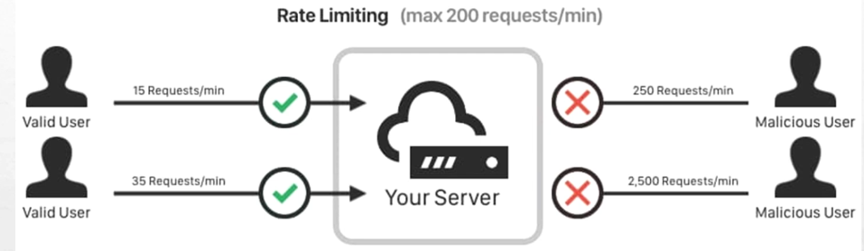

# Rate Limiter

## Là gì


Chặn kết nối nếu 1 người dùng gửi quá nhiều request.

## Tại sao cần

Ví dụ server chỉ có khả năng xử lý 200 request/min. Nếu truy cập trên mức đó thì hệ thống sẽ sập. Nếu có một người cố tình phá, họ gửi 250 request/min, sever sẽ bị sập.

Ta giải quyết trường hợp này bằng cách tạo một rate limit middleware báo lỗi `429: Too many requests`

### Triển khai

1. Khởi tạo middleware:

- Dùng IP / tài khoản của user để xác định người dùng truy cập vào server bao nhiêu lần. Trong trường hợp này tôi sử dụng IP
- Khởi tạo client với limiter và thời gian truy cập thông qua các tham số:
  - `requestSec:` Số lượng kết nối cho tối đa với client đó
  - `burst:` Số token cấp pháp lại trong mỗi phút để truy cập.
  - IP
  - Dùng `mu.Lock()` để tránh trường hợp race condition, panic hoặc sai lệch dữ liệu khi có nhiều goroutines cùng truy cập để vào biến toàn cục `clients`. VD: có 2 request từ 1 IP, goroutine chưa có limiter thì khởi tạo limiter và ghi vào map `clients`. Gây là lỗi panic `fatal error: concurrent map writes`.
- Nếu limiter cho phép truy cập thì chuyển người dùng vào handler.
- Tạo thêm go routine CleanUpClients() chạy định mỗi phút để xoá các client không còn hoạt động

```go
func RateLimitingMiddleware(recoveryLogger *zerolog.Logger) gin.HandlerFunc {
	return func(ctx *gin.Context) {
		ip := getClientIP(ctx)
		limiter := getRateLimiter(ip)
		if !limiter.Allow() {
			if shouldLogRateLimit(ip) {
				recoveryLogger.Warn().
					Str("client_ip", ctx.ClientIP()).
					Str("user_agent", ctx.Request.UserAgent()).
					Str("referer", ctx.Request.Referer()).
					Str("protocol", ctx.Request.Proto).
					Str("host", ctx.Request.Host).
					Str("remote_addr", ctx.Request.RemoteAddr).
					Str("request_uri", ctx.Request.RequestURI).
					Interface("headers", ctx.Request.Header).
					Msg("rate limiter exceeded")
			}
			ctx.AbortWithStatusJSON(http.StatusTooManyRequests, gin.H{
				"error":   "Too many requests",
				"message": "Too many requests.Please try again",
			})
			return
		}
		ctx.Next()
	}
}
```

Lưu ý: Để tránh việc log quá nhiều lần thì hệ thống sẽ không log ra những request cùng IP trong vòng 10 giây

Hướng cải tiến trong tương lai:

1. "Hacker có thể dùng IP giống để truy cập thì sao?"

Nếu vậy, những người dùng có cùng IP (dùng chung wifi) sẽ bị chặn oan. Hacker cũng có thể dùng IP giả để né rate limiter. Vì vậy, ứng dụng sẽ sử dụng userID (nếu đăng nhập) hoặc IP + User-Agent để đảm bảo chặt chẽ hơn.

2. “Nếu hacker gửi chậm 199 requests/phút thì sao?”

- Nếu một IP gửi request có thời gian xử lý lâu bất thường -> nghi ngờ DDos
- Gửi quá nhiều request thì bắt nhập CAPTCHA

3. “Giả sử bạn deploy service trên 5 instance. Dùng map để lưu IP có đảm bảo đồng bộ không?”

- Sử dụng Redis cache để chia sẻ toàn hệ thống

4. “Bạn đã từng phải debug rate limiter chưa? Nếu user report bị chặn oan thì kiểm tra gì?”

- Thêm vào whitelist IP, thêm burst, track theo userID thay vì IP
