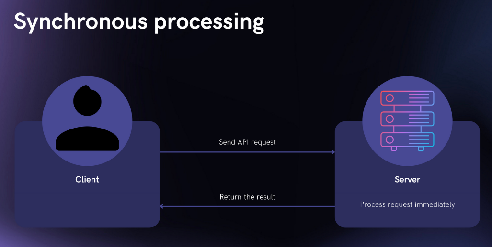
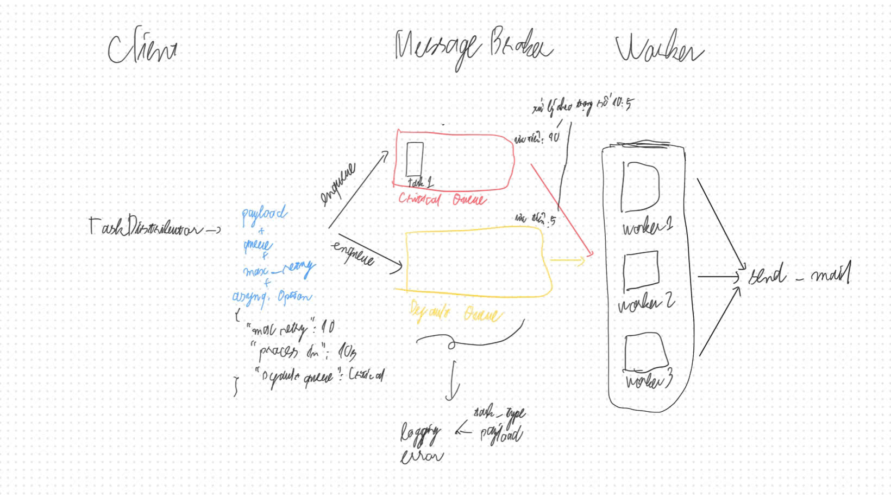

# Sending Mail

## Mục tiêu:
- Thêm chức năng gủi mail cho người dùng khi hoàn thành việc thanh toán.
- Đảm bảo việc gửi mail không làm ảnh hưởng đến sự ổn định, hiệu năng của luồng chính bằng việc xử lý bất đồng bộ.
- Có logging rõ ràng để debug
- Có cơ chế retry và rollback khi việc booking hoặc redis bị lỗi

## Lựa chọn công nghệ

### Đồng bộ hay bất đồng bộ?
Theo cách đơn giản nhất, ta sẽ thực hiện gửi mail một cách **đồng bồ**. Tuy nhiên, điều này có bất cập như sau: Server phải đợi việc gửi mail hoàn thành thì mới làm việc khác được. Nếu gửi mail bị lỗi hoặc tốn nhiều thời gian, điều này sẽ làm ảnh hưởng đến hiệu năng chung của hệ thống

Vì vậy, việc gửi mail nên được thực hiện **bất đồng bộ**:

**Cách 1: Dùng Goroutine**
Ưu:
- Đảm bảo bất đồng bộ
- Đơn giản

Nhược:
- Không hỗ trợ retry nếu task bị mất

**Cách 2: Dùng **message broker** (Redis) + **background worker****:
Ưu:
- Task được lưu ở cả trong bộ nhớ RAM và ổ đĩa.
- Có thể scale lên bằng Redis Sentinnel hoặc Redis clusters.
- Task không bị mất

Nhược:
- Hơi phức tạp hơn cách 1

Tôi sẽ chọn cách 2 do cách này đáp ứng được các mục tiêu đề ra ban đầu.

**Lưu ý:** Thực ra trước đây, tôi có thử sử dụng Kafka để làm tính năng gửi mail bằng Kafka. Luồng như sau:

Client gọi `/api/send_mail` -> handler -> producer (Go) truyền task vào message broker của Kafka -> consumer (Goroutine) lấy task từ Kafka. Tuy nhiên, phương án này không hiệu quả vì những lý do sau đây:
- Setup Kafka sẽ phức tạp và nặng hơn Redis (chỉ nên dùng cho những hệ thống thực sự lớn).
- Phải tự implement cơ chế retry ở consumer thay vì có sẵn như Redis.
- Không nên trao quyền gửi mail cho client do:
  + Khó tracking.
  + Hacker có thể dùng để gửi mail giả danh.

### Thư viện sử dụng để gửi mail
Thư viện `go/smtp` của Go có hỗ trợ chức năng gửi mail. Tuy nhiên, ta việc định nghĩa message để tuân theo chuẩn khá là mất thời gian. Vậy nên tôi sẽ sử dụng thư viện [email](https://github.com/jordan-wright/email) của jordan-wright. Đây là thư viện dù commit cuối từ 5 năm trước nhưng vẫn đủ tốt và được nhiều người dùng.

## Triển khai

1. Khởi tạo TaskDistributor
- Thiết lập kết nối đến địa chỉ Redis
- Cấu hình các thông tin cần thiết cho task
  - asynq.MaxRetry(10): Số lần thử lại nếu bị lỗi là 10.
  - asynq.ProcessIn(10 * time.Second): task sẽ được pick bởi worker 10s sau khi khởi tạo.
  - asynq.Queue: queue mặc định là critical queue.
**Lưu ý:** Trong trường hợp transaction booking xử lý quá lâu rồi mới commit nhưng worker đã xử lý luôn. Vậy nên khi worker cần kết quả của booking đó mà không có. Ngoài ra, có thể bổ sung thêm async tự động retry để phòng edge case transaction kéo dài hơn 10 giây.

2. Khởi tạo TaskProcessor
- Tạo một instance của `RedisTaskProcessor` với các tham số: kết nối Redis, store (database), mailer (EmailSender).
- Cấu hình các queue ưu tiên trong asynq (ví dụ: "critical", "default") và error handler để log lỗi khi xử lý task.
- Đăng ký các handler cho từng loại task (ví dụ: `TaskSendVerifyEmail`).

3. Chạy TaskProcessor dưới dạng 1 go routine
- Trong hàm `main`, gọi `taskProcessor.Start()` để worker bắt đầu lắng nghe và xử lý các task từ Redis queue.
- Số lượng worker phụ thuộc vào số nhân của CPU.
- Có thể chạy song song với HTTP server để vừa phục vụ API, vừa xử lý task nền.

4. Worker xử lý tác vụ gửi mail
- Worker lấy task từ queue, giải mã payload.
- Gọi mailer để gửi email thực tế.
- Nếu gửi thành công, log lại kết quả.
- Nếu thất bại, asynq sẽ tự động retry theo cấu hình hoặc log lỗi nếu hết số lần retry.

## Hướng cải thiện
1. "Nếu một task retry mãi không được thì sao?"
- Hiện tại hệ thống đang để số lần retry tối đa là 10. Nếu sau 10 lần vẫn không được thì sẽ log ra lỗi bằng zero log. Trong tương lai, tôi có lẽ sẽ bổ sung Dead Letter Queue để lưu các task lỗi để xử lý và cảnh báo sau.
2. "Hệ thống này có đảm exactly-once delivery không?"
- Redis không hỗ trợ exactly-once delivery. Để khắc phục điều đấy ta làm như sau:
  - Tạo task_id check xem cache có không
  - Không có thì lưu vào cache với TTL = 24h rồi đẩy vào Redis
  - Có thì thôi không đẩy vào Redis nữa

3. "Thế nếu Redis sập thì task sẽ bị mất đúng không?"
- Không hẳn. Redis có cơ chế lưu dữ liệu vào ổ đĩa. Còn nếu để ở chế độ chỉ lưu trong RAM thì sẽ bị mất thật. Để khắc phục thì chúng ta có thể triển khai Redis Cluter để đảm bảo HA.

6. “Bạn có test hệ thống gửi mail chưa? Đơn vị hay tích hợp?”
- Tôi mới chỉ viết unit test cho hàm gửi mail và test bằng tay do không có thời gian.