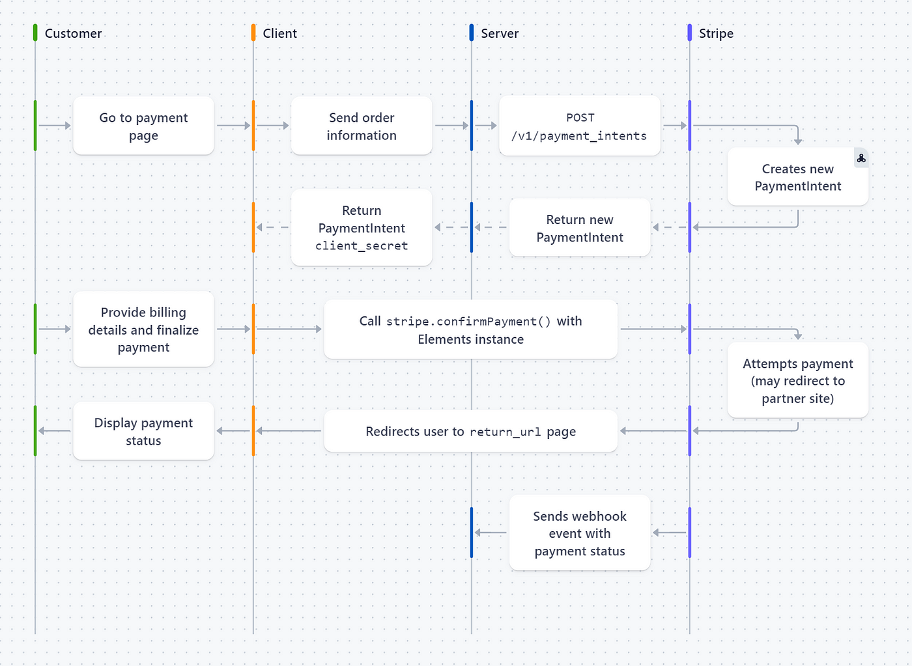

# Stripe
(Xem ipad)
## Why Stripe?
- Support multiple payment method
- Automatically handle policy issues
- Well-known


## Flow diagram



## Step1: Create payment intent
### What is it?
Payment intent is a object that serve 2 purpose:
- Colect payment from a customer
- Track payment lifecycle


### Why need this?
It helps:
- Handle complex payment flow that may require multiple steps or authentication
- Manage policy automatically
- Track payment history
- Handle multiple payment method in 1 API
- Handle gracefully declined payment and retries
- Prevent duplicate charges for the same order

### How to implement it?
- Input:
```json
{
  "booking_id": 1, //metadata to keep track booking info
  "amount": 1000,
  "currency": "usd",
}
```
- Output:
```json
{
"secret_key": "..."
}
```
- Flow:
```
/api/create-intents -> paymentHandler -> createPaymentUseCase <- PaymentGateway interface {CreatePaymentIntent} -> CreatePaymentIntent
```

## Step2: Collect payment detail on the client

## Step3: Submit payment detail to Stripe

## Step4: Handle Webhook and post-processing events
### Why need this??
- Continue to retry delivery web hook event notifications(including payment status) with exponential backoff algorithm despite server goes down.
- Retry sending up to 3 days.

### How to implement it?
```Go
func handleWebhook(w http.ResponseWriter, r *http.Request) {
	if r.Method != "POST" {
		http.Error(w, http.StatusText(http.StatusMethodNotAllowed), http.StatusMethodNotAllowed)
		return
	}
	b, err := ioutil.ReadAll(r.Body)
	if err != nil {
		http.Error(w, err.Error(), http.StatusBadRequest)
		log.Printf("ioutil.ReadAll: %v", err)
		return
	}

	event, err := webhook.ConstructEvent(b, r.Header.Get("Stripe-Signature"), os.Getenv("STRIPE_WEBHOOK_SECRET"))
	if err != nil {
		http.Error(w, err.Error(), http.StatusBadRequest)
		log.Printf("webhook.ConstructEvent: %v", err)
		return
	}

	if event.Type == "payment_intent.succeeded" {
		fmt.Println("💰 Payment succeeded")
	}

	writeJSON(w, nil)
}
```
